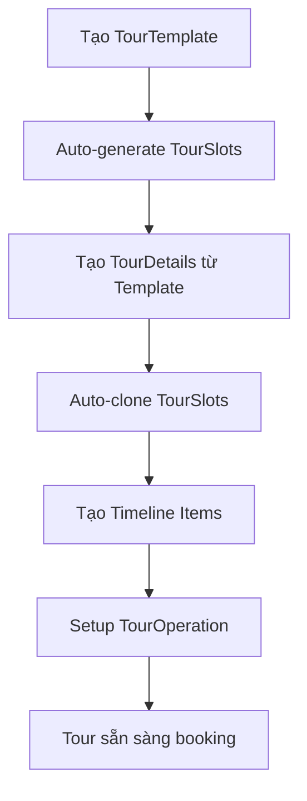

# 🎯 TourTemplate System - Hướng dẫn sử dụng

## 📋 Tổng quan

Hệ thống TourTemplate được thiết kế theo kiến trúc **Template-Based Tour Management** với flow tự động hóa cao:

```
TourTemplate → Auto TourSlots → TourDetails → TourOperation + Timeline
```

## 🚀 Các tính năng chính

### 1. **TourTemplate Management**
- ✅ Tạo, sửa, xóa tour templates
- ✅ Auto-generation TourSlots khi tạo template
- ✅ Validation nghiêm ngặt (chỉ Thứ 7 hoặc Chủ nhật)
- ✅ Hỗ trợ 2 loại tour: FreeScenic và PaidAttraction

### 2. **TourDetails Management**
- ✅ Tạo tour details từ template
- ✅ Auto-clone TourSlots từ template
- ✅ Quản lý trạng thái approval workflow
- ✅ Timeline management tích hợp

### 3. **Timeline Builder**
- ✅ Tạo và quản lý timeline items
- ✅ Batch creation hỗ trợ tạo nhiều items cùng lúc
- ✅ Tích hợp với SpecialtyShop system
- ✅ Drag & drop reordering

### 4. **Dashboard & Analytics**
- ✅ Thống kê tổng quan templates và details
- ✅ Phân tích theo loại tour và trạng thái
- ✅ Monitoring performance và slots utilization

## 🔧 Cách sử dụng

### **Bước 1: Tạo TourTemplate**

```typescript
// Sử dụng hook
const { createTemplate } = useTourTemplate();

const templateData: CreateTourTemplateRequest = {
    title: "Tour Núi Bà Đen VIP",
    startLocation: "TP.HCM",
    endLocation: "Tây Ninh",
    templateType: TourTemplateType.FreeScenic,
    scheduleDays: ScheduleDay.Saturday, // Chỉ 0 hoặc 6
    month: 7,
    year: 2025,
    images: ["image1.jpg", "image2.jpg"]
};

await createTemplate(templateData);
```

### **Bước 2: Tạo TourDetails từ Template**

```typescript
const { createDetails } = useTourTemplate();

const detailsData: CreateTourDetailsRequest = {
    tourTemplateId: "template-guid",
    title: "Lịch trình VIP Núi Bà Đen",
    description: "Lịch trình cao cấp với dịch vụ VIP",
    skillsRequired: "Tiếng Anh, Lịch sử địa phương"
};

await createDetails(detailsData);
```

### **Bước 3: Tạo Timeline**

```typescript
const { createTimeline } = useTourTemplate();

const timelineData: CreateTimelineItemsRequest = {
    tourDetailsId: "details-guid",
    timelineItems: [
        {
            checkInTime: "07:00",
            activity: "Ăn sáng",
            sortOrder: 1
        },
        {
            checkInTime: "08:00",
            activity: "Khởi hành đến Núi Bà",
            sortOrder: 2
        },
        {
            checkInTime: "10:00",
            activity: "Ghé shop bánh tráng",
            specialtyShopId: "shop-guid",
            sortOrder: 3
        }
    ]
};

await createTimeline(timelineData);
```

## 📊 Components có sẵn

### **1. TourTemplateManagement**
```typescript
import TourTemplateManagement from '@/pages/tourcompany/TourTemplateManagement';

// Sử dụng trong route
<Route path="tour-templates" element={<TourTemplateManagement />} />
```

### **2. TourDetailsManagement**
```typescript
import TourDetailsManagement from '@/pages/tourcompany/TourDetailsManagement';

// Sử dụng trong route
<Route path="tour-details" element={<TourDetailsManagement />} />
```

### **3. TimelineBuilder**
```typescript
import TimelineBuilder from '@/components/tourcompany/TimelineBuilder';

// Sử dụng trong component
<TimelineBuilder
    tourDetailsId={detailsId}
    timeline={existingTimeline}
    onUpdate={handleTimelineUpdate}
    specialtyShops={availableShops}
/>
```

### **4. TourSlotsList**
```typescript
import TourSlotsList from '@/components/tourcompany/TourSlotsList';

// Hiển thị slots của template
<TourSlotsList
    templateId={templateId}
    template={templateData}
    slots={templateSlots}
    onSlotUpdate={handleSlotUpdate}
/>
```

### **5. TourTemplateDashboard**
```typescript
import TourTemplateDashboard from '@/components/tourcompany/TourTemplateDashboard';

// Dashboard tổng quan
<TourTemplateDashboard />
```

## 🎨 Styling

Import CSS để sử dụng styling có sẵn:

```scss
@import '@/styles/tourTemplate.scss';
```

Các class CSS chính:
- `.tour-template-management`
- `.tour-details-management`
- `.timeline-builder`
- `.tour-slots-list`
- `.tour-template-dashboard`

## ⚠️ Validation Rules

### **TourTemplate**
- `title`: Bắt buộc, tối đa 200 ký tự
- `templateType`: Chỉ 1 (FreeScenic) hoặc 2 (PaidAttraction)
- `scheduleDays`: Chỉ 0 (Sunday) hoặc 6 (Saturday)
- `startLocation`, `endLocation`: Bắt buộc, tối đa 500 ký tự
- `month`: 1-12
- `year`: 2024-2030

### **Timeline**
- `checkInTime`: Format HH:mm (00:00-23:59)
- `activity`: Bắt buộc, tối đa 255 ký tự
- `sortOrder`: Số nguyên dương

## 🔍 Error Handling

Hệ thống có error handling tự động:

```typescript
import { handleApiError } from '@/services/tourcompanyService';

try {
    await createTemplate(data);
} catch (error) {
    const errorMessage = handleApiError(error);
    message.error(errorMessage);
}
```

## 📈 Performance Monitoring

Sử dụng performance tracker có sẵn:

```typescript
import { performanceTracker } from '@/services/tourcompanyService';

performanceTracker.start('Create Template');
await createTemplate(data);
performanceTracker.end('Create Template');
```

## 🔄 State Management

Sử dụng hook `useTourTemplate` để quản lý state:

```typescript
const {
    templates,
    tourDetails,
    templatesLoading,
    detailsLoading,
    loadTemplates,
    createTemplate,
    updateTemplate,
    deleteTemplate,
    createDetails,
    updateDetails,
    deleteDetails,
    createTimeline,
    refreshData
} = useTourTemplate();
```

## 🚦 Workflow tổng thể



## 📝 Best Practices

1. **Luôn validate dữ liệu** trước khi gửi API
2. **Sử dụng performance tracker** cho các operations quan trọng
3. **Handle errors gracefully** với user-friendly messages
4. **Refresh data** sau khi thực hiện CRUD operations
5. **Sử dụng loading states** để cải thiện UX
6. **Implement proper pagination** cho danh sách lớn

## 🔧 Troubleshooting

### **Lỗi validation scheduleDays**
```
Error: "Chỉ được chọn Thứ 7 (Saturday) hoặc Chủ nhật (Sunday)"
```
**Giải pháp**: Chỉ sử dụng `ScheduleDay.Saturday` (6) hoặc `ScheduleDay.Sunday` (0)

### **Lỗi auto-generation slots**
```
Error: "Không thể tạo slots cho tháng/năm đã chọn"
```
**Giải pháp**: Kiểm tra tháng/năm hợp lệ và template đã được tạo thành công

### **Lỗi timeline validation**
```
Error: "Thời gian phải theo định dạng HH:mm"
```
**Giải pháp**: Sử dụng format "HH:mm" cho checkInTime (VD: "08:30")

## 📞 Support

Nếu gặp vấn đề, vui lòng:
1. Kiểm tra console logs để xem chi tiết lỗi
2. Verify API endpoints và authentication
3. Kiểm tra network requests trong DevTools
4. Tham khảo file `tourtemplateflow.md` để hiểu API specification
